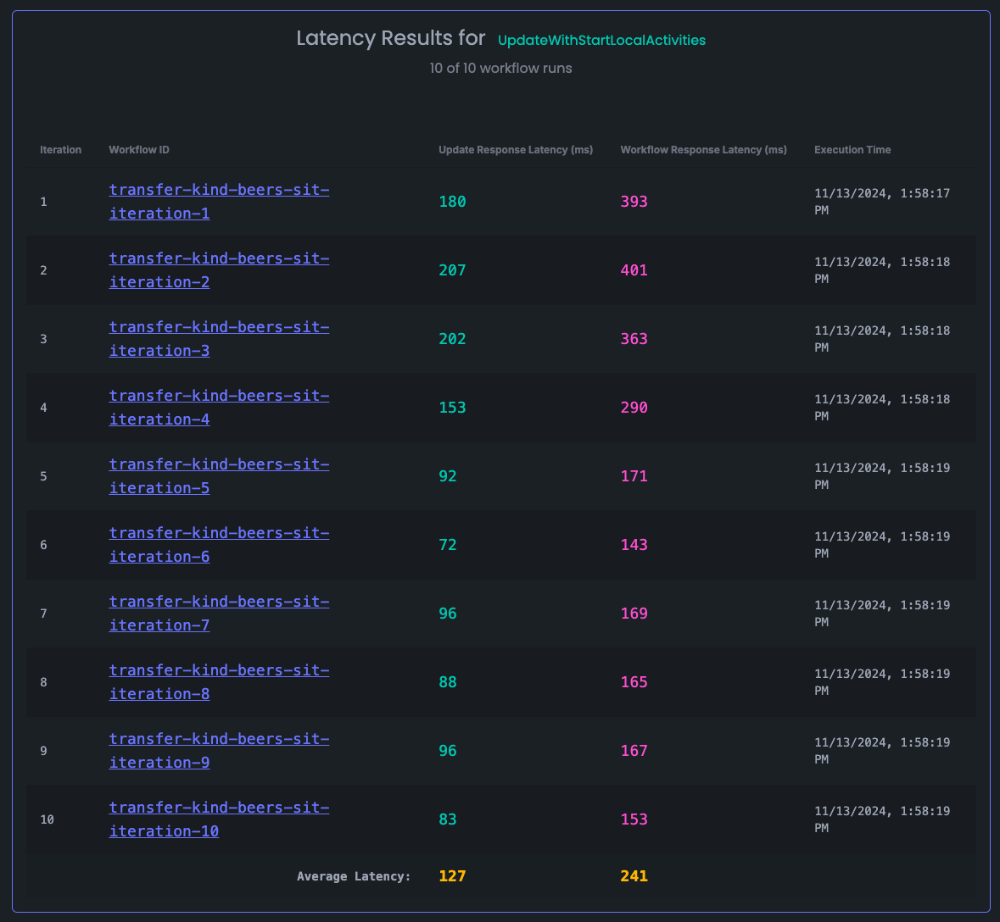

## Temporal Latency Optimization Scenarios

This repository contains a set of scenarios to test the latency of Temporal workflows in various configurations.

Results screen for the `Update-With-Start (Local Activities)` scenario:


### Scenarios
* Run Workflow (Regular Activities): Runs the workflow in its entirety and returns the result to the client.
* Run Workflow (Regular Activities): Runs the workflow in its entirety but uses local activities and returns the result to the client.
* Update-With-Start (Regular Activities): Demonstrates the "Early Return" pattern. Returns a value to the client from an update before the workflow completes.
* Update-With-Start (Local Activities): Demonstrates the "Early Return" pattern. Same as Update-With-Start (Regular Activities), but uses a local activity inside the update handler.
* Eager Workflow Start: runs the workflow in its [entirety eagerly](https://temporal.io/blog/improving-latency-with-eager-workflow-start) with local activities and returns the result to the client.

### Setup
1. Ensure you have a Temporal Service running. You can use the Temporal Cloud or run a local instance (`brew install temporal && temporal server start-dev`).
2. Install the `just` CLI tool: `brew install just`.
3. Clone this repository and navigate to the root directory: `git clone https://github.com/temporal-sa/temporal-latency-optimization-scenarios.git` and `cd temporal-latency-optimization-scenarios`.
4. Install the dependencies for the web server and the Python worker: `cd web && npm install && cd ../worker && poetry install`.
5. Copy the `.env.template` file to `.env` and update the values as needed.

### Enable Pre-Release Features
1. You may need to enable Update, Update With Start, and Eager Workflow Start
2. For Cloud, reach out to your account team
3. For local testing, add these to your `temporal server start-dev`:

    `--dynamic-config-value frontend.enableUpdateWorkflowExecutionAsyncAccepted=true --dynamic-config-value frontend.enableUpdateWorkflowExecution=true --dynamic-config-value frontend.enableExecuteMultiOperation=true --dynamic-config-value system.enableEagerWorkflowStart=true`

### Running the Scenarios
Before running any `just` commands, ensure your environment is clean by unsetting any existing Temporal environment variables:

```bash
unset TEMPORAL_TASK_QUEUE TEMPORAL_CONNECTION_NAMESPACE TEMPORAL_CONNECTION_TARGET TEMPORAL_CONNECTION_MTLS_KEY_FILE TEMPORAL_CONNECTION_MTLS_CERT_CHAIN_FILE TEMPORAL_CONNECTION_WEB_PORT CALLER_API_PORT PUBLIC_WEB_URL
```

1. Start the web server: `just run_web`.
2. Start the Temporal worker: `just run_temporal`.
3. Navigate to the web server in your browser (default is `http://0.0.0.0:5178`).